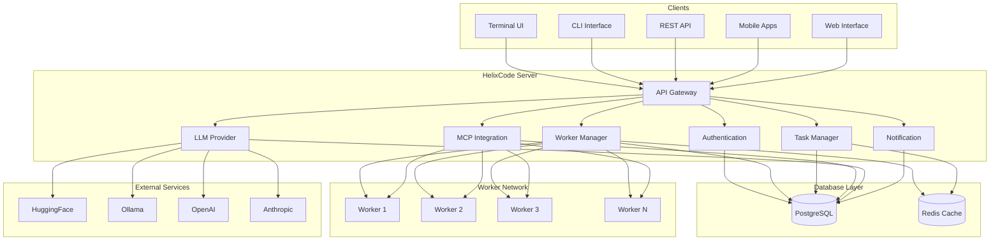
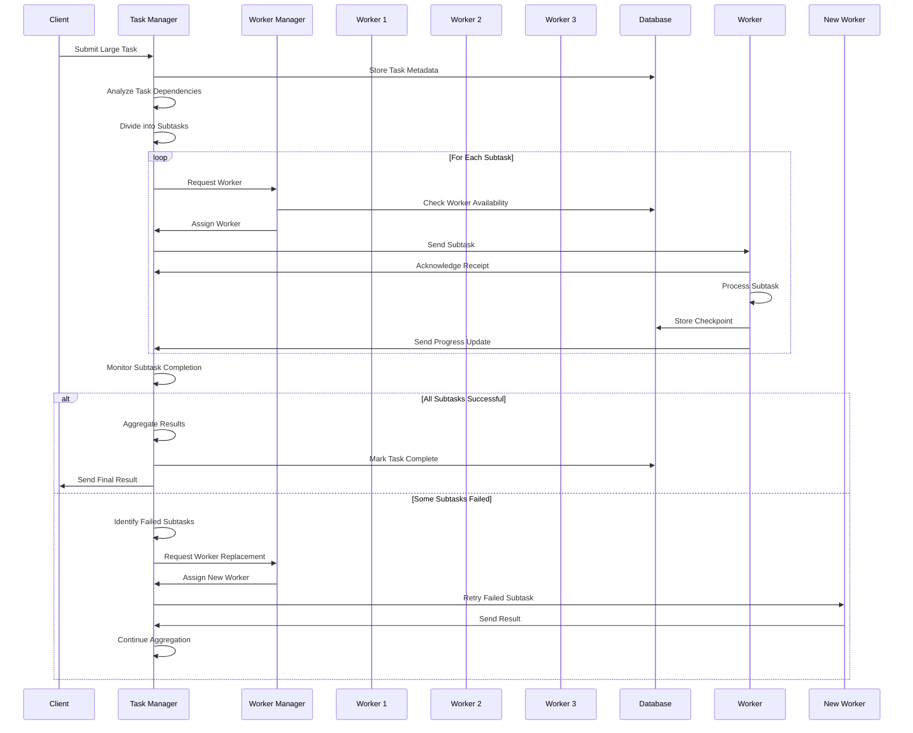
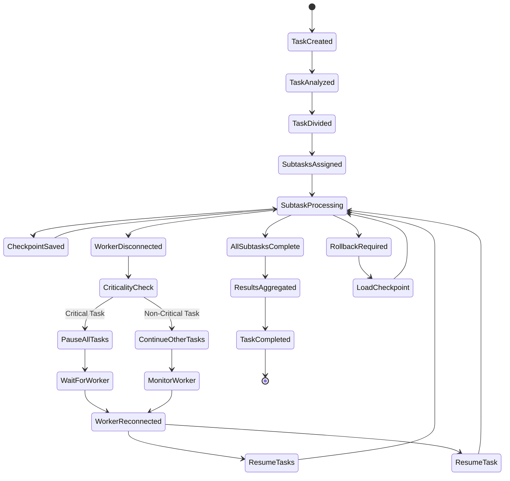
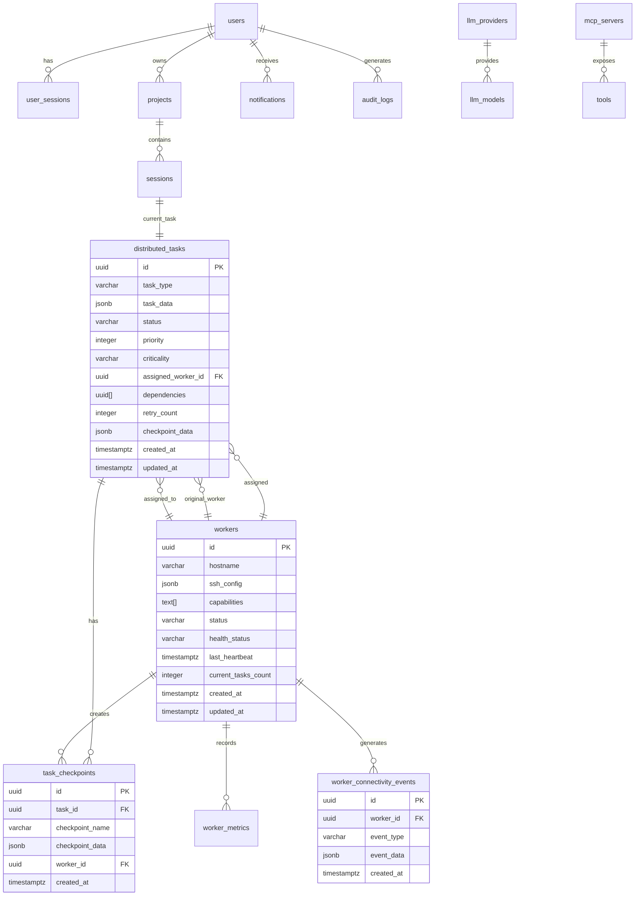
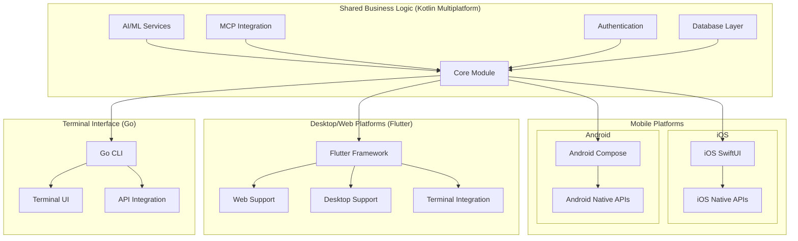
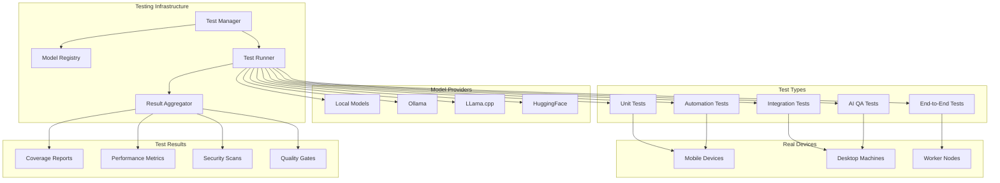

# HelixCode - Architecture Diagrams

## System Architecture Overview

### Core System Architecture

### Distributed Task Processing Architecture

### Work Preservation & Rollback Architecture

### Database Schema Relationships

### Cross-Platform Client Architecture

### Real Model Testing Architecture

## Key Architectural Features

### 1. Distributed Task Division
- **Intelligent Task Splitting**: Automatically divides large tasks into optimal subtasks
- **Dependency Management**: Handles complex task dependencies across workers
- **Load Balancing**: Distributes work based on worker capabilities and current load
- **Progress Tracking**: Real-time monitoring of all subtask progress

### 2. Work Preservation Mechanisms
- **Automatic Checkpointing**: Regular save points for all tasks
- **Worker Health Monitoring**: Continuous monitoring of worker connectivity
- **Criticality-Based Pausing**: Pauses entire workflow for critical task failures
- **Graceful Degradation**: Continues non-critical tasks during worker issues

### 3. Cross-Platform Architecture
- **Shared Business Logic**: Kotlin Multiplatform for mobile platforms
- **Unified Desktop/Web**: Flutter for consistent desktop and web experience
- **Native Terminal**: Go-based CLI for maximum terminal performance
- **Platform-Specific Optimization**: Leverages native capabilities where needed

### 4. Real Model Testing
- **Multi-Provider Support**: Tests with local and remote model providers
- **Hardware Alignment**: Uses models that match local machine capabilities
- **Comprehensive Coverage**: 100% test coverage across all test types
- **Real Device Validation**: Testing on actual hardware devices